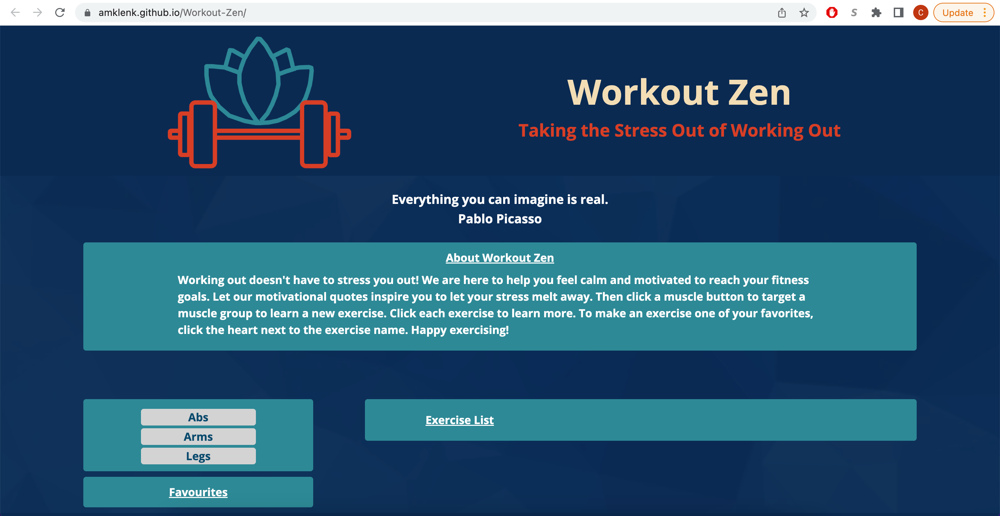
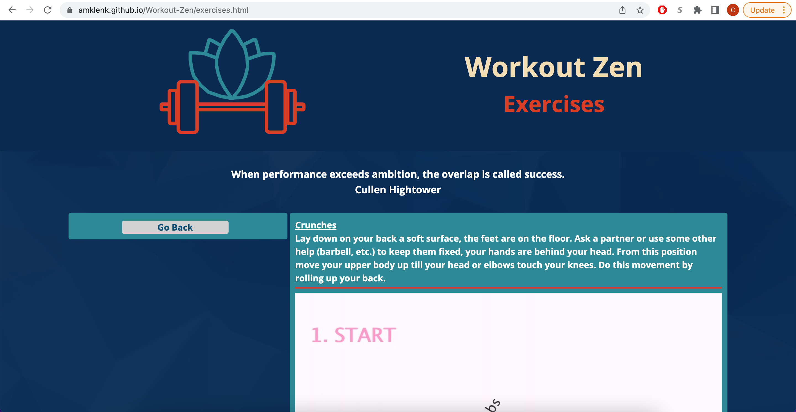
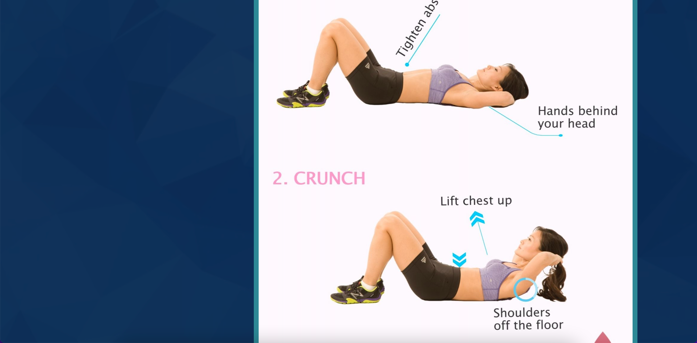

# Workout-Zen

## Description

This project was created for a person who is new to working out so that they can learn how to workout certain muscle groups, in a low-stress environment, and get fit.
The contributors are:

- Colin Alexander
- Amanda Klenk
- Hannah Nicks
- Mtende Roll

The following are the requirements set by the contributors:
- When the user visits the application, they will see a motivation quote and buttons with each muscle group listed.
- When the user clicks a muscle group button, the exercise list will show exercises that target that muscle group.
- When the user clicks on an exercise, they will be redirected to a page that shows the details of that exercise.
  The project creation had additional requirements. The site needed to:
- Use a CSS framework other than Bootstrap.
- Be deployed to GitHub Pages.
- Be interactive (i.e., accept and respond to user input).
- Use at least two server-side APIs.
- Not use alerts, confirms, or prompts (use modals).
- Use client-side storage to store persistent data.
- Be responsive.
- Have a polished UI.
- Have a clean repository that meets quality coding standards (file structure, naming conventions, follows best practices for class/id naming conventions, indentation, quality comments, etc.).
- Have a quality README (with unique name, description, technologies used, screenshot, and link to deployed application).

## Table of Contents

- [Installation](#installation)
- [Links](#links)
- [Usage](#usage)
- [Credits](#credits)
- [License](#license)
- [Project-Status](#project-status)

## Installation

The repository, Workout-Zen, was created and cloned from GitHub. An index.html file and an exercise.html file were created and coded to contain the site content and the individual exercise content. A folder, assets, was created to house three folders: css, images, and js. The css folder contains the style sheets, style.css and exerstyle.css, which was created and coded to contain the site formatting and design for the index page and the exercise page, respectively. The images folder contains an image of the logo, the background image, and a screenshot of the live site. The js folder contains the script sheets, quote.js and workout.js, which was created and coded to allow the site to be dynamic. The file quote.js fetches and renders the motivational quotes. The file workout.js fetches and renders the exercise data.

## Links

- [GitHub Repository](https://github.com/amklenk/Workout-Zen)
- [GitHub Pages Site](https://amklenk.github.io/Workout-Zen/)

## Usage

The following images are screenshots of the live site and an exercise eample on GitHub Pages:

  The site is navagable via the muscle group buttons (to display the exercise list), the exercises within the exercise list (to redirect to the exercise page and render the data), the go back button on the exercise page (to redirect the user back to the index page), the favorites button(NOT SURE ABOUT THIS YET), and the submit button (NOT SURE HERE EITHER).

## Credits

- [Design Inspiration](https://dribbble.com/shots/18129733-Fitness-Landing-Page-UI-Design)
- [Background Triangles](https://www.123freevectors.com/abstract-blue-polygonal-triangular-background-130903/)
- [Lotus Icon](https://www.svgrepo.com/svg/194899/lotus-flower)
- [Barbell Icon](https://thenounproject.com/icon/barbell-232902/)
- Exercise Images:
  - [Crunches](https://www.pinterest.com/pin/151433606204448550/)
  - [Plank](https://mirafit.co.uk/blog/how-to-do-the-perfect-plank-a-beginners-guide/)
  - [Flutter Kicks](https://fitmw.com/transverse-abdominal/)
  - [Bicep Curls With Dumbell](https://www.myupchar.com/en/fitness/standing-dumbbell-curl)
  - [Seated Tricep Press](https://criticalbody.com/seated-dumbbell-overhead-tricep-extension/)
  - [Pike Pushup](https://whitecoattrainer.com/web-stories/in-this-post-we-are-going-to-cover-the-best-of-the-best-bodyweight-shoulder-exercises-we-will-go-over-21-different-exercises-each-one-focusing-on-a-specific-muscle-of-the-shoulder-complex-story)
  - [Forward Lunge](https://www.24life.com/master-this-move-lunge/)
  - [Squats](https://www.istockphoto.com/photo/side-view-of-a-young-woman-in-sportswear-doing-squats-at-blue-background-in-studio-gm1217661802-355526830)
  - [High Knees](https://workouttrends.com/how-to-do-high-knees)

## License

MIT License
Copyright (c) [2022]
Permission is hereby granted, free of charge, to any person obtaining a copy
of this software and associated documentation files (the "Software"), to deal
in the Software without restriction, including without limitation the rights
to use, copy, modify, merge, publish, distribute, sublicense, and/or sell
copies of the Software, and to permit persons to whom the Software is
furnished to do so, subject to the following conditions:
The above copyright notice and this permission notice shall be included in all
copies or substantial portions of the Software.
THE SOFTWARE IS PROVIDED "AS IS", WITHOUT WARRANTY OF ANY KIND, EXPRESS OR
IMPLIED, INCLUDING BUT NOT LIMITED TO THE WARRANTIES OF MERCHANTABILITY,
FITNESS FOR A PARTICULAR PURPOSE AND NONINFRINGEMENT. IN NO EVENT SHALL THE
AUTHORS OR COPYRIGHT HOLDERS BE LIABLE FOR ANY CLAIM, DAMAGES OR OTHER
LIABILITY, WHETHER IN AN ACTION OF CONTRACT, TORT OR OTHERWISE, ARISING FROM,
OUT OF OR IN CONNECTION WITH THE SOFTWARE OR THE USE OR OTHER DEALINGS IN THE
SOFTWARE.

## Project Status

This project is a work in progress. The pictures will be replaced with YouTube videos. More exercises will be added to each button and more buttons will be added to the website so the user can access all of the API features. Another update we will be adding is a search button for our users to search for specific workouts. Additional information will be added to each exercise description to provide clearer instructions as to how specific workouts are done.
GitHubGitHub
GitHub - amklenk/Workout-Zen
Contribute to amklenk/Workout-Zen development by creating an account on GitHub. (107 kB)
https://github.com/amklenk/Workout-Zen

Dribbble
Fitness Landing Page UI Design
Fitness Landing Page UI Design designed by ASAD. Connect with them on Dribbble; the global community for designers and creative professionals. (Not automatically expanded because 3 MB is too large. You can expand it anyway or open it in a new window.)
Dribbbled by
@Dodulll
svgrepo.comsvgrepo.com
Lotus Flower Vector SVG Icon - SVG Repo
Free Lotus Flower Vector Icon in SVG format. :white_check_mark: Download Free Lotus Flower Vector and icons for commercial use. Lotus Flower SVG vector illustration graphic art design format. vector
